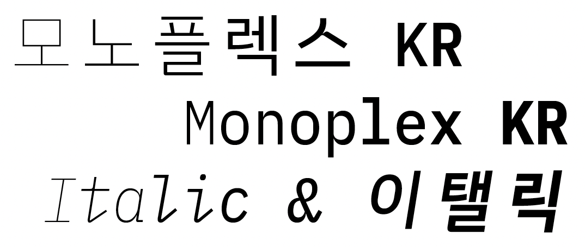
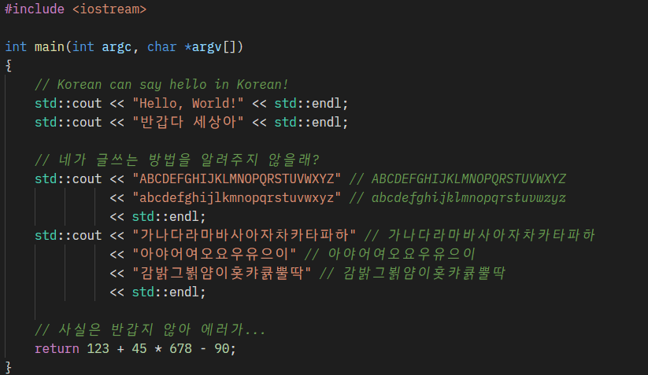
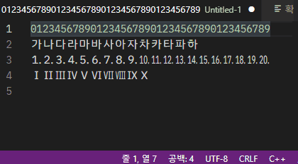

[^1]

[^1]: 글꼴 이름을 표현하는 그림의 아이디어는 Microsoft [Cascadia Code](https://github.com/microsoft/cascadia-code)에서 가져왔습니다.

# Monoplex KR (모노플렉스 KR)

Monoplex KR은 IBM Plex Mono에 IBM Plex Sans KR의 글자를 더해서 만든 프로그래밍 글꼴입니다. 두 글꼴에 모두 글자가 있는 경우 IBM Plex Mono를 사용합니다.

이 글꼴 만들어 주는 스크립트는 [PlemolJP](https://github.com/yuru7/PlemolJp) 프로젝트에서 가져왔습니다.

# 가족 구성

Monoplex KR은 아래의 네 가족이 친족을 이룹니다.

- `Monoplex KR`: 넓은폭문자와 좁은폭문자의 너비 비율이 2:1인 고정폭 글꼴입니다.
- `Monoplex KR Nerd`: Monoplex KR에 Powerline 기호, 매테리얼 디자인 등이 포함된 Nerd Fonts가 더해진 글꼴입니다.
- `Monoplex KR Wide`: 넓은폭문자와 좁은폭문자의 너비 비율이 5:3인 고정폭 글꼴입니다.
- `Monoplex KR Wide Nerd`: Monoplex KR Wide에 Powerline 기호, 매테리얼 디자인 등이 포함된 Nerd Fonts가 더해진 글꼴입니다.

# 갤러리

# 설치

릴리즈 페이지에서 글꼴을 받아주세요:  https://github.com/y-kim/monoplex/releases

압축파일을 풀면 ttf 파일이 생성됩니다. 각 운영체제에서 제공하는 방법을 사용하여 글꼴을 설치할 수 있습니다.

# 직접 빌드하기

릴리즈 페이지의 파일은 아래의 패키지가 설치된 Arch Linux on WSL2에서 생성됩니다. 하지만 아래의 패키지가 설치되어 있다면 리눅스 배포판에 따른 차이는 없을 것이라고 생각합니다.

- fontforge 20201107-1
- ttfautohint 1.8.4-1 (AUR)
- Python2 2.7.18-5
  - fonttools 3.44.0

# 요청

Microsoft Visual Studio Code에서 수직 방향으로 커서를 움직일 때 커서의 시각적 위치가 급격하게 바뀌는 경우가 있습니다. 이는 vscode에서 시각적 위치를 계산할 때 CJK의 주요 문자를 제외한 모든 기호의 너비를 Latin 문자와 동일하게 계산하기 때문입니다.

문자의 시각적 너비에 대한 변경을 요청하는 기능 개선 요청([Vertical cursor movement considering character width.](https://github.com/microsoft/vscode/issues/136226))이 현재 backlog 후보에 올라와있습니다. 이 기능에 공감하신다면 위 티켓에서 엄지 손가락을 눌러주세요. Backlog에 올라가기 위해서는 엄지 20개가 필요합니다. 
