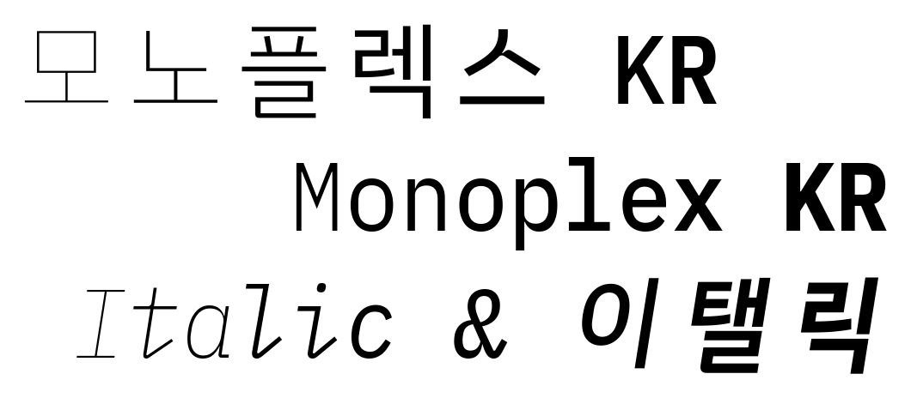
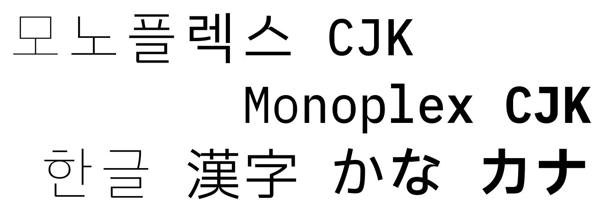
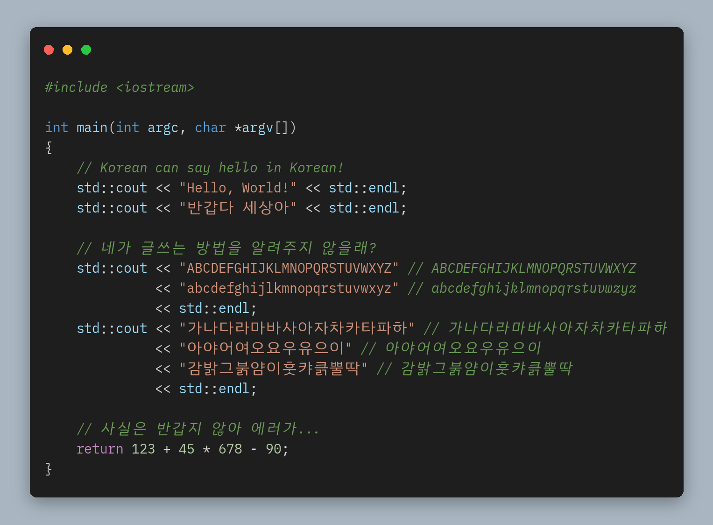
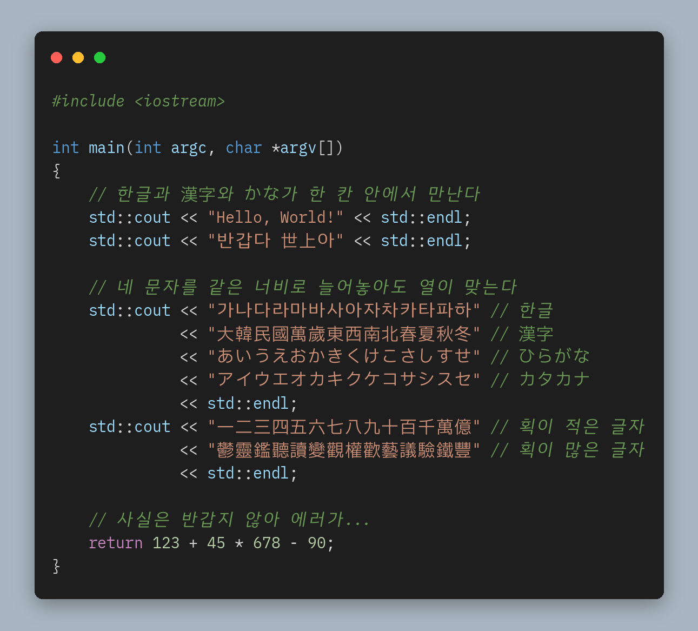
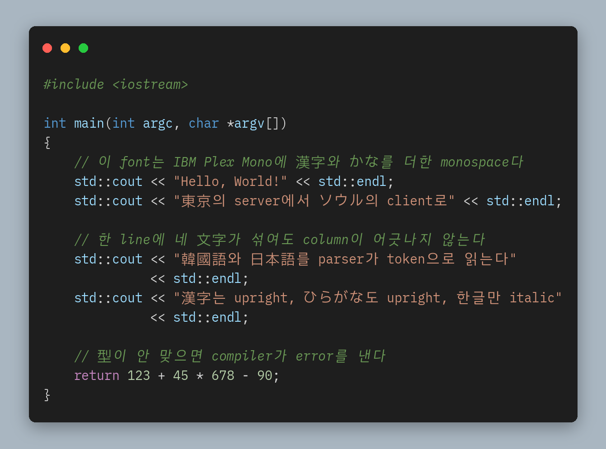
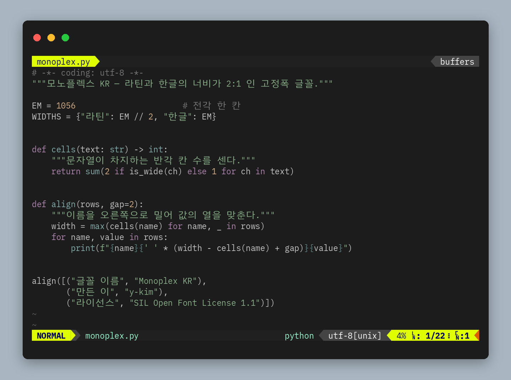
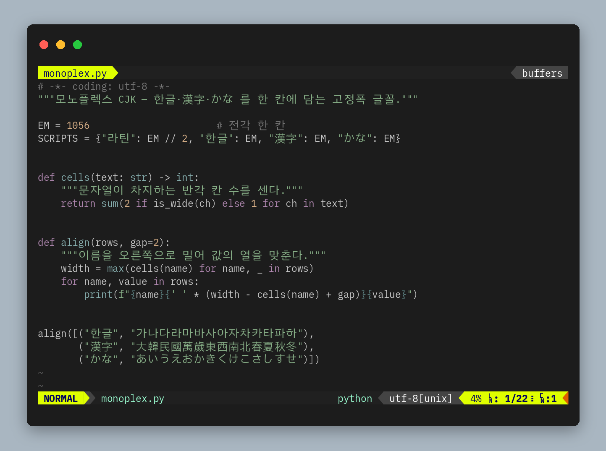
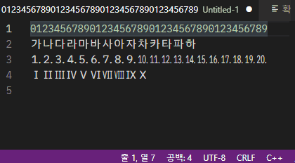

[^1]

[^1]: 글꼴 이름을 표현하는 그림의 아이디어는 Microsoft [Cascadia Code](https://github.com/microsoft/cascadia-code)에서 가져왔습니다.

# Monoplex (모노플렉스)

IBM Plex Mono에 동아시아 글자를 더해서 만든 프로그래밍 글꼴입니다.
넓은폭문자와 좁은폭문자의 너비 비율이 **2:1**인 고정폭이라, 한글이나 한자가
섞여도 칸이 어긋나지 않습니다.

두 계열이 있습니다.

| | 담은 글자 | 쓰임 |
|---|---|---|
| **Monoplex KR** | 라틴 + 한글 | 한글만 쓰는 경우 |
| **Monoplex CJK** | 라틴 + 한글 + 한자 + 가나 | 한자나 일본어가 섞이는 경우 |

각 계열에 Nerd Fonts를 더한 판이 따로 있어서, 모두 네 가족입니다.

- `Monoplex KR` / `Monoplex KR Nerd Font`
- `Monoplex CJK` / `Monoplex CJK Nerd Font`

Nerd Font 판에는 Powerline 기호, Material Design Icons, Codicons, Devicons 등이
들어 있습니다. 터미널 프롬프트나 파일 아이콘을 쓰신다면 이쪽입니다.

## 어느 것을 고를까

**Monoplex KR**은 한자가 없습니다. IBM Plex Sans KR 자체가 한글 전용이라
`漢字`가 한 글자도 들어 있지 않습니다. 한국어 문서에 한자가 섞이면 시스템
대체 글꼴로 넘어가면서 **고정폭 정렬이 깨집니다.**

**Monoplex CJK**는 그 자리를 채웁니다. KS X 1001의 한자 4,888자를 빠짐없이
덮고, 히라가나·가타카나·반각 가타카나까지 들어 있어 일본어도 그대로 나옵니다.
대신 파일이 4배쯤 큽니다.

한자를 쓸 일이 없다면 KR이 가볍고 충분합니다.

# Monoplex CJK



한자와 가나는 IBM Plex Sans의 지역 변종에서 가져왔습니다. 같은 코드포인트를
여러 글꼴이 갖고 있을 때는 아래 순서로 먼저 있는 것을 씁니다.

```
IBM Plex Mono  →  Plex Sans KR  →  Plex Sans JP  →  Plex Sans TC  →  Plex Sans SC
   라틴              한글            가나·한자         한자 보충        간체·확장A
```

한자를 얹으면서 두 가지를 손봤습니다.

- **세로 위치** — Plex Sans의 한자는 한글보다 자면 중심이 75유닛 위에 있습니다.
  최대 자면 기준으로 한글이 −166까지 내려오는데 한자는 −99에서 멈춥니다.
  섞어 쓰면 한자만 들려 보여서, 한글 중심에 맞춰 내렸습니다.
- **이탤릭** — 한자와 가나는 이탤릭 두께에서도 곧게 둡니다. CJK는 전통적으로
  이탤릭이 없어 기울이면 어색합니다. 기울이는 것은 라틴과 한글뿐입니다.

호환한자(U+F900–FAFF)는 소스 글꼴에 없지만, 같은 한자의 다른 독음을 유니코드가
따로 부호화한 것이라 자형이 통합한자 쪽과 같습니다. cmap을 연결해 두어서
KS X 1001을 100% 덮습니다.

# 갤러리

**Monoplex KR** — 라틴과 한글의 너비가 2:1 로 맞습니다.



**Monoplex CJK** — 한글·한자·히라가나·가타카나를 나란히 놓아도 오른쪽 끝이
한 열에 떨어집니다.



**한 줄에 섞어 쓸 때** — 한국어 문장의 명사만 로마자·한자·가나로 바꾼
것입니다. 반각과 전각이 한 줄에서 예닐곱 번 번갈아도 아래 줄과 열이 맞습니다.
주석 줄에서는 라틴과 한글만 기울고 한자·가나는 곧게 섭니다.



**Nerd Font 판** — vim + [vim-airline](https://github.com/vim-airline/vim-airline)
화면입니다. Powerline 구분자가 한 칸에 들어갑니다.





그림은 모두 `scripts/` 안의 스크립트가 만듭니다. 빌드한 글꼴로 직접 그리므로
글꼴을 고치면 `sh scripts/images.sh` 로 갱신됩니다. vim 화면은 흉내가 아니라
실제 vim 을 띄워 `term_scrape()` 로 받아 온 것입니다.

# 설치

릴리즈 페이지에서 글꼴을 받아주세요: https://github.com/y-kim/monoplex/releases

압축파일을 풀면 ttf 파일이 생성됩니다. 각 운영체제에서 제공하는 방법을 사용하여
글꼴을 설치할 수 있습니다.

# 직접 빌드하기

빌드 도구는 [hapchija](https://github.com/y-kim/hapchija) 저장소에 있고 `tools/`
서브모듈로 들어옵니다. 소스 글꼴은 용량이 커서 저장소에 넣지 않고 받아 옵니다.

```bash
git clone --recursive https://github.com/y-kim/monoplex
cd monoplex

# 소스 글꼴 받기 (KR 은 24MB, CJK 는 175MB)
PYTHONPATH=tools/src python3 -m hapchija fetch --recipe recipes/monoplex-kr.json

docker run --rm -v "$(pwd):/work" ghcr.io/yuru7/composite-font-builder \
  bash -c "cd /work && PYTHONPATH=tools/src python3 -m hapchija build --recipe recipes/monoplex-kr.json"
```

`recipes/monoplex-cjk.json` 으로 바꾸면 CJK 판이 나옵니다.

| 문서 | 내용 |
|---|---|
| [HOW_TO_BUILD.md](HOW_TO_BUILD.md) | 빌드하는 법 |
| [RECIPE.md](RECIPE.md) | 레시피가 무엇을 왜 그렇게 하는지 |
| [VERSIONING.md](VERSIONING.md) | 버전을 매기는 기준 |
| [CHANGELOG.md](CHANGELOG.md) | 변경 이력 |
| [release-notes/](release-notes/) | 가족별 릴리즈 노트 |

# 사용한 소스 글꼴

버전은 글꼴 파일 안의 값(name ID 5)입니다. 배포 채널의 패키지 번호와는 다를 수
있습니다. 예를 들어 `@ibm/plex-mono@2.5.0` 릴리스에 들어 있는 글꼴의 내부
버전은 `2.005` 입니다.

| 글꼴 | 내부 버전 | 업스트림 릴리스 | 쓰는 곳 |
|---|---|---|---|
| IBM Plex Mono | 2.005 | [`@ibm/plex-mono@2.5.0`](https://github.com/IBM/plex/releases/tag/%40ibm%2Fplex-mono%402.5.0) | 라틴 |
| IBM Plex Sans KR | 1.002 | [`v6.4.2`](https://github.com/IBM/plex/releases/tag/v6.4.2) (마지막 통합 릴리스) | 한글 |
| IBM Plex Sans JP | 1.004 | [`@ibm/plex-sans-jp@3.0.0`](https://github.com/IBM/plex/releases/tag/%40ibm%2Fplex-sans-jp%403.0.0) | CJK: 가나·한자 |
| IBM Plex Sans TC | 1.001 | [`@ibm/plex-sans-tc@1.1.1`](https://github.com/IBM/plex/releases/tag/%40ibm%2Fplex-sans-tc%401.1.1) | CJK: 한자 보충 |
| IBM Plex Sans SC | 1.000 | [`@ibm/plex-sans-sc@1.1.0`](https://github.com/IBM/plex/releases/tag/%40ibm%2Fplex-sans-sc%401.1.0) | CJK: 간체·확장A |
| Blex Mono Nerd Font | Nerd Fonts 3.5.1 | [`v3.5.1`](https://github.com/ryanoasis/nerd-fonts/releases/tag/v3.5.1) | Nerd Font 판 |

IBM Plex Sans KR 은 2024-11 에 1.003 이 나왔지만 **올리지 않았습니다.**
자면은 사실상 같은데(bbox 12,151/12,156자가 완전 일치) 반각 한글 자모
(U+FFA1–FFDC)를 비롯한 57자가 빠지고 16자만 늘어납니다. 늘어난 16자는 이미
IBM Plex Mono 쪽에 있어서 쓰이지 않으므로, 얻는 것 없이 잃기만 합니다.

Nerd Fonts 글리프 중 Pomicons(U+E000–U+E00A)는 라이선스상 상업적 이용이
제한되어 포함하지 않았습니다.

# 요청



Microsoft Visual Studio Code에서 수직 방향으로 커서를 움직일 때 커서의 시각적 위치가 급격하게 바뀌는 경우가 있습니다. 이는 vscode에서 시각적 위치를 계산할 때 CJK의 주요 문자를 제외한 모든 기호의 너비를 Latin 문자와 동일하게 계산하기 때문입니다.

문자의 시각적 너비에 대한 변경을 요청하는 기능 개선 요청([Vertical cursor movement considering character width.](https://github.com/microsoft/vscode/issues/136226))이 현재 backlog 후보에 올라와있습니다. 이 기능에 공감하신다면 위 티켓에서 엄지 손가락을 눌러주세요. Backlog에 올라가기 위해서는 엄지 20개가 필요합니다.
