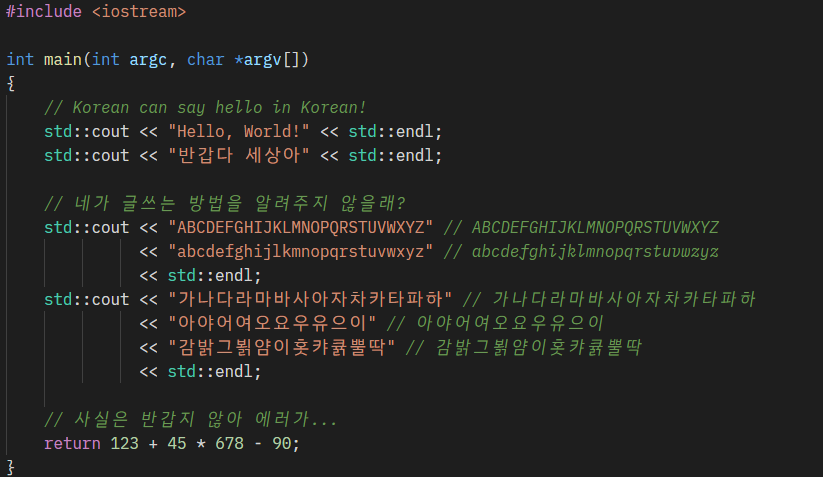

[^1]

[^1]: 글꼴 이름을 표현하는 그림의 아이디어는 Microsoft [Cascadia Code](https://github.com/microsoft/cascadia-code)에서 가져왔습니다.

# Monoplex KR (모노플렉스 KR)

Monoplex KR은 IBM Plex Mono에 IBM Plex Sans KR의 글자를 더해서 만든 프로그래밍 글꼴입니다. 두 글꼴에 모두 글자가 있는 경우 IBM Plex Mono를 사용합니다.

이 글꼴 만들어 주는 스크립트는 [PlemolJP](https://github.com/yuru7/PlemolJp) 프로젝트에서 가져왔습니다.

# 가족 구성

Monoplex KR은 아래의 두 가족이 친족을 이룹니다.

- `Monoplex KR`: 넓은폭문자와 좁은폭문자의 너비 비율이 2:1인 고정폭 글꼴입니다.
- `Monoplex KR Nerd Font`: Monoplex KR에 Powerline 기호, 매테리얼 디자인 등이 포함된 Nerd Fonts가 더해진 글꼴입니다.

# 갤러리



# 설치

릴리즈 페이지에서 글꼴을 받아주세요:  https://github.com/y-kim/monoplex/releases

압축파일을 풀면 ttf 파일이 생성됩니다. 각 운영체제에서 제공하는 방법을 사용하여 글꼴을 설치할 수 있습니다.

# 직접 빌드하기

빌드 도구는 [hapchija](https://github.com/y-kim/hapchija) 저장소에 있고 `tools/`
서브모듈로 들어옵니다.

```bash
git clone --recursive https://github.com/y-kim/monoplex
cd monoplex
docker run --rm -v "$(pwd):/work" ghcr.io/yuru7/composite-font-builder \
  bash -c "cd /work && PYTHONPATH=tools/src python3 -m hapchija build --recipe recipes/monoplex-kr.json"
```

자세한 내용은 [HOW_TO_BUILD.md](HOW_TO_BUILD.md) 를 참고하세요.

# 사용한 소스 글꼴

| 글꼴 | 내부 버전 | 업스트림 릴리스 |
|---|---|---|
| IBM Plex Mono | 2.005 | [IBM/plex](https://github.com/IBM/plex/releases/tag/%40ibm%2Fplex-mono%402.5.0) `@ibm/plex-mono@2.5.0` |
| IBM Plex Sans KR | 1.002 | [IBM/plex](https://github.com/IBM/plex/releases/tag/v6.4.2) `v6.4.2` (마지막 통합 릴리스) |
| Blex Mono Nerd Font | Nerd Fonts 3.5.1 | [ryanoasis/nerd-fonts](https://github.com/ryanoasis/nerd-fonts/releases/tag/v3.5.1) `v3.5.1` |

IBM Plex Sans KR 은 2024-11 에 1.003 이 나왔지만 **올리지 않았습니다.**
반각 한글 자모(U+FFA1–FFDC)를 비롯한 57 자가 빠지고 16 자만 늘어나는데,
늘어난 16 자는 이미 IBM Plex Mono 쪽에 있어서 쓰이지 않습니다.

Nerd Fonts 글리프 중 Pomicons(U+E000–U+E00A)는 라이선스상 상업적 이용이
제한되어 포함하지 않았습니다.

# 요청


Microsoft Visual Studio Code에서 수직 방향으로 커서를 움직일 때 커서의 시각적 위치가 급격하게 바뀌는 경우가 있습니다. 이는 vscode에서 시각적 위치를 계산할 때 CJK의 주요 문자를 제외한 모든 기호의 너비를 Latin 문자와 동일하게 계산하기 때문입니다.

문자의 시각적 너비에 대한 변경을 요청하는 기능 개선 요청([Vertical cursor movement considering character width.](https://github.com/microsoft/vscode/issues/136226))이 현재 backlog 후보에 올라와있습니다. 이 기능에 공감하신다면 위 티켓에서 엄지 손가락을 눌러주세요. Backlog에 올라가기 위해서는 엄지 20개가 필요합니다. 
